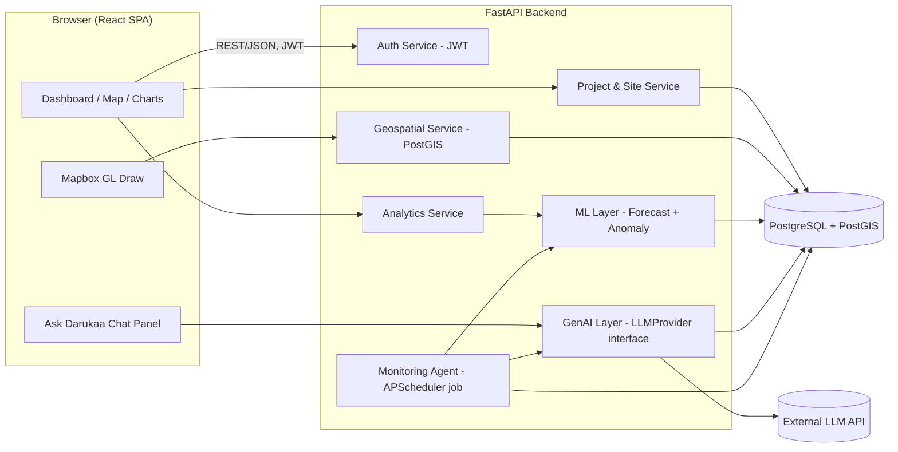
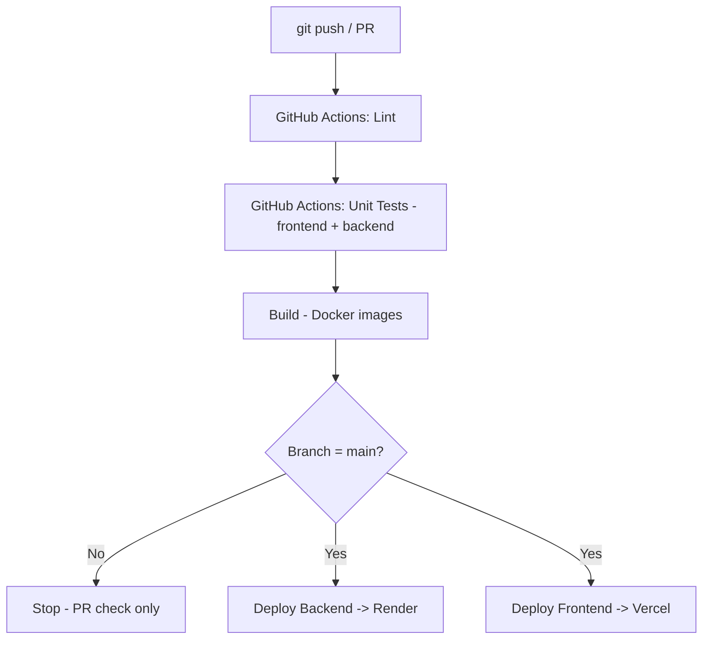

# Technical Requirements Document (TRD)
## Darukaa.Earth — Geospatial Carbon & Biodiversity Analytics Platform

---

## 1. Tech Stack & Justification

| Layer | Choice | Why (vs. alternatives) |
|---|---|---|
| Frontend framework | **React + TypeScript + Vite** | Required by brief; TS + Vite for speed/type-safety, not mandated but strengthens "Code Quality" score |
| Map | **Mapbox GL JS + `@mapbox/mapbox-gl-draw`** | Required by brief; Draw plugin gives polygon drawing for free |
| Charting | **Chart.js** (via `react-chartjs-2`) | Required (either Highcharts or Chart.js); Chart.js is free/MIT (Highcharts needs a license for commercial use — worth noting as a trade-off in the README) |
| Styling | Tailwind CSS | Fast, consistent, easy to make it look designed rather than default |
| Backend framework | **FastAPI (Python)** | Required option; async-native, automatic OpenAPI docs (nice demo artifact), Pydantic validation, best ecosystem fit for the AI/ML layer (vs Flask/Django which are heavier or more sync-oriented) |
| ORM / migrations | SQLAlchemy 2.0 + Alembic | Industry standard, works cleanly with PostGIS via GeoAlchemy2 |
| Database | **PostgreSQL 15 + PostGIS** | Required; native geospatial types/queries (`ST_Area`, `ST_Contains`, `ST_AsGeoJSON`) |
| Auth | JWT (access + refresh) via `python-jose` / `fastapi-users` | Required; refresh token adds robustness beyond bare minimum |
| ML | `scikit-learn` (IsolationForest, linear regression) + `statsmodels`/`Prophet` optional for forecasting | Lightweight, no GPU/infra needed, fast to train per-site at request time or nightly |
| GenAI | LLM API behind a `LLMProvider` interface (Claude and/or OpenAI) | Provider-agnostic — a deliberate architecture decision to call out in trade-offs |
| Agent scheduling | APScheduler (in-process) for hackathon simplicity; note Celery+Redis as the production upgrade path | Avoids standing up Redis/broker infra just for a demo, while the README shows you know the "real" answer |
| CI/CD | **GitHub Actions** | Required |
| Pre-commit / lint-staged | **Husky + lint-staged + Prettier + ESLint** (frontend), **pre-commit + Black + Ruff** (backend) | Required, called "crucial" |
| Hosting | Frontend → **Vercel**; Backend + Postgres → **Render.com** (Render supports PostGIS-enabled Postgres) | Matches brief's suggested platforms; free tiers cover a demo |
| Containerization | Docker + docker-compose for local dev parity | Not explicitly required but strengthens "System Architecture" and makes CI/CD reproducible |

---

## 2. System Architecture



---

## 3. Database Schema

```
users
  id (pk), email (unique), hashed_password, role [admin|viewer], created_at

projects
  id (pk), owner_id (fk -> users.id), name, description,
  project_type [carbon|biodiversity|both], start_date, created_at

sites
  id (pk), project_id (fk -> projects.id), name,
  geom (PostGIS GEOMETRY(POLYGON, 4326)), area_ha (computed via ST_Area),
  created_at

site_metrics   -- time series
  id (pk), site_id (fk -> sites.id), recorded_at (date),
  carbon_tco2e (float), biodiversity_index (float), ndvi (float)

site_status
  site_id (fk, unique), status [healthy|watch|at_risk],
  last_evaluated_at, anomaly_score

reports
  id (pk), project_id (fk, nullable), site_id (fk, nullable),
  report_type [ai_summary|funder_report|agent_alert],
  content (text/markdown), generated_at, generated_by [system|user]

notifications
  id (pk), site_id (fk), message, severity [info|warning|critical],
  created_at, read_at (nullable)
```

**Indexes:** GiST index on `sites.geom`; composite index on `(site_id, recorded_at)` for
`site_metrics` to keep time-series queries fast.

**Key trade-off to document:** metrics are stored per-site as rows rather than a wide table, so the
schema stays extensible if new metric types are added later without migrations.

---

## 4. API Surface (representative, not exhaustive)

```
POST   /auth/register
POST   /auth/login              -> {access_token, refresh_token}
POST   /auth/refresh

GET    /projects
POST   /projects
GET    /projects/{id}
POST   /projects/{id}/sites             (body includes GeoJSON polygon)
GET    /sites/{id}
GET    /sites/{id}/metrics?range=90d
GET    /sites/{id}/forecast             (ML forecast + confidence band)
GET    /sites/{id}/status               (health status + anomaly score)

POST   /assistant/query                 (Ask Darukaa — NL question -> grounded answer)
POST   /reports/generate                (project_id or site_id -> GenAI report)
GET    /notifications                   (agent-raised alerts)

POST   /internal/agent/run              (triggerable by scheduler; idempotent)
```

All endpoints except `/auth/*` require a valid JWT bearer token.

---

## 5. AI/ML Component Design

### 5.1 Forecasting
- Per site, pull the metric series (e.g., `carbon_tco2e` over time).
- Fit a simple trend model (linear regression on time index, or `statsmodels` Holt-Winters if the
  series has enough points) and project N future periods with a naive confidence interval
  (± std of residuals).
- Cache the fitted result for a short TTL (e.g., 1 hour) to avoid recomputation on every chart load —
  call this out explicitly as a performance decision.

### 5.2 Anomaly Detection
- `IsolationForest` (unsupervised) over the recent window of a site's normalized metrics, or a
  simpler z-score threshold if time is short — document why you chose the simpler option if you
  descope (transparency about trade-offs is scored).
- Output feeds `site_status.status`, which the frontend uses for map polygon color and the badge
  on the site detail page.

### 5.3 GenAI Layer
- `LLMProvider` abstract interface with a concrete Claude/OpenAI implementation — keeps the
  vendor swappable and demonstrates clean architecture.
- Two call sites:
  1. **Ask Darukaa** — retrieval-style: fetch the relevant project/site rows + recent metrics as
     structured context, inject into a constrained system prompt ("only answer from the provided
     data; say so if the answer isn't in it"), return the model's answer.
  2. **Report generation** — feed a site's/project's metric summary + anomaly flags into a prompt
     that produces a short narrative report, stored in `reports`.

### 5.4 Agent Loop
Simple, explicit, and demoable — resist over-engineering with a full agent framework unless there's
spare time:
```
on schedule (e.g. every 10 min in demo, daily in "prod"):
  for each site:
      metrics = fetch_recent(site)
      score, status = anomaly_model.evaluate(metrics)
      if status changed to "at_risk":
          summary = genai.draft_alert(site, metrics, score)
          create Report(type=agent_alert, content=summary)
          create Notification(site, message=summary_short, severity=critical)
      update site_status
```

---

## 6. CI/CD Pipeline



- **Pre-commit hooks (local, before CI even runs):** Husky triggers `lint-staged` on
  `git commit` → Prettier + ESLint on staged frontend files; a Python `pre-commit` config runs
  Black + Ruff on staged backend files. This is the "crucial requirement" called out in the brief —
  implement it first, not last.
- **GitHub Actions workflow (`.github/workflows/ci.yml`):** matrix job for frontend (`npm ci`,
  `npm run lint`, `npm test`, `npm run build`) and backend (`pip install`, `ruff check`, `pytest`).
- **CD:** Vercel auto-deploys on push to `main` via its GitHub integration; Render auto-deploys the
  backend service the same way (both are "push to deploy," satisfying the automatic-deployment
  requirement without hand-rolled deploy scripts — document this choice as intentional simplicity).

---

## 7. Security & Non-Functional Requirements

- Passwords hashed with `bcrypt`; JWT secrets via environment variables, never committed.
- CORS restricted to the deployed frontend origin.
- Rate limiting on `/assistant/query` and `/reports/generate` (LLM calls cost money — worth a
  paragraph in the README about cost-consciousness, which reads well to evaluators).
- Basic input validation via Pydantic models on every endpoint.
- `.env.example` committed; real secrets only in Render/Vercel dashboards.

## 8. Testing Strategy

- Backend: `pytest` for service-layer unit tests (geometry area calc, anomaly classification
  thresholds, forecast shape) + a couple of API integration tests via `httpx`/`TestClient`.
- Frontend: Vitest + React Testing Library for at least the project-creation and site-detail flows.
- Not aiming for high coverage in hackathon time — aim for tests that prove the *risky* logic
  (geospatial math, anomaly thresholds) is correct, and say so explicitly in the README.
