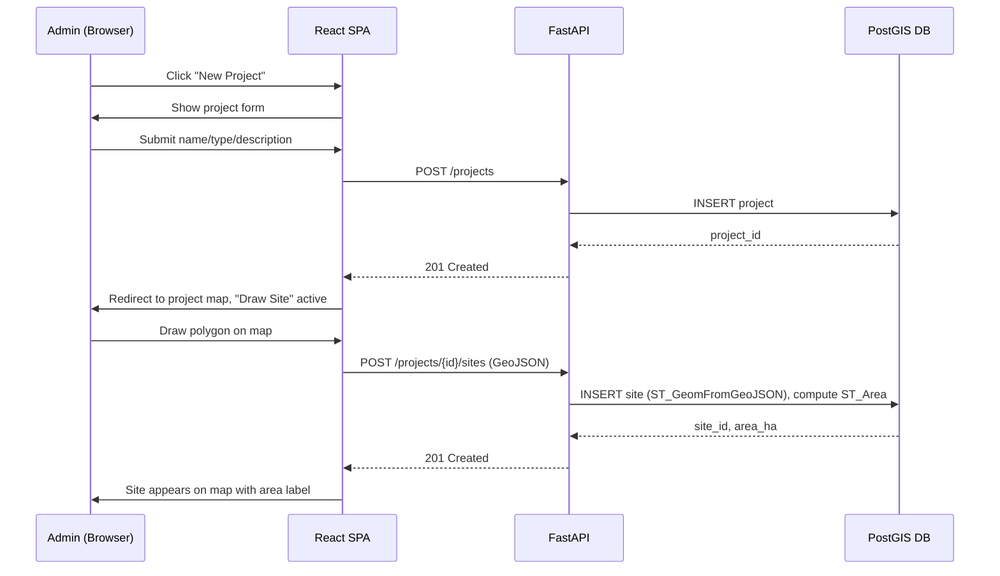
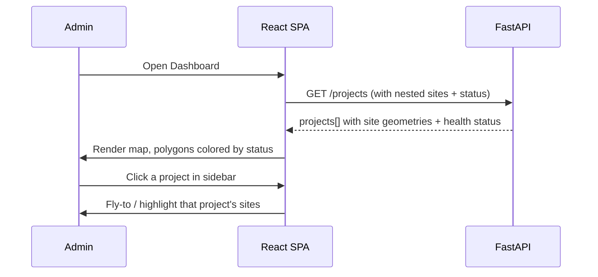
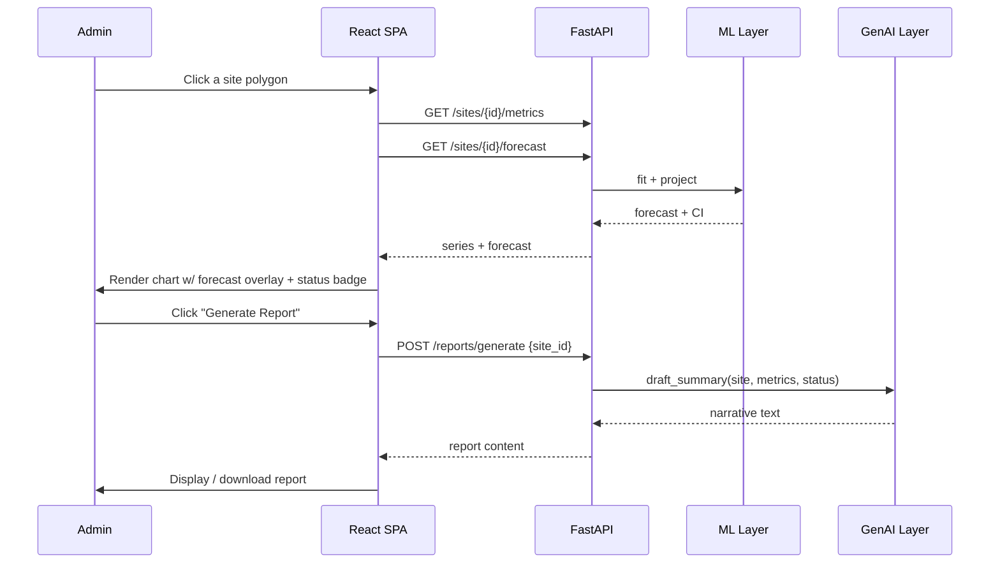
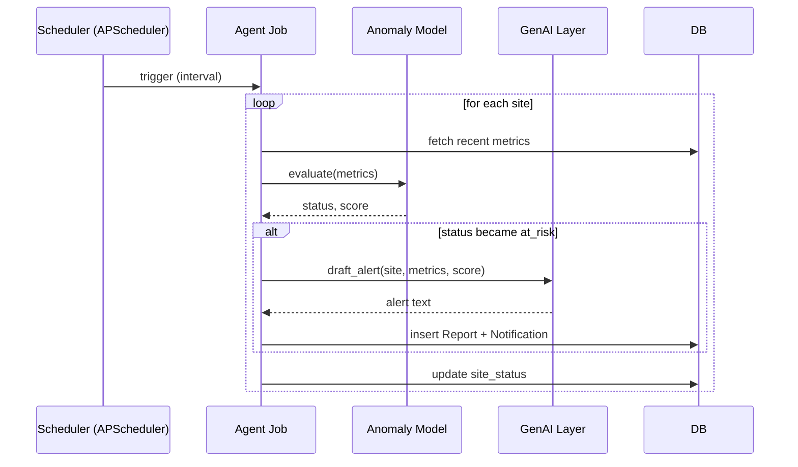

# Project Flow & Execution Plan
## Darukaa.Earth — Geospatial Carbon & Biodiversity Analytics Platform

---

## 1. Key User Flows

### 1.1 Create Project → Add Site (core Story 1)



### 1.2 Portfolio Map View (core Story 2)



### 1.3 Site Detail + Forecast + Report (core Story 3 + differentiators)



### 1.4 Autonomous Agent Loop (differentiator)



---

## 2. Repository & Git Workflow

```
darukaa-earth/
├── frontend/           # React + TS + Vite
├── backend/            # FastAPI app
│   ├── app/
│   │   ├── api/        # routers
│   │   ├── models/     # SQLAlchemy models
│   │   ├── services/   # geospatial, ml, genai, agent
│   │   └── core/       # config, security
│   ├── alembic/
│   └── tests/
├── .github/workflows/ci.yml
├── docker-compose.yml
└── README.md
```

**Branching:** `main` (protected, always deployable) ← `feature/*` branches ← PR with CI checks
required to pass before merge. Keep commits scoped and messages conventional
(`feat:`, `fix:`, `chore:`) — this directly feeds the "clean, logical commit history" deliverable.

---

## 3. Suggested Build Order (time-boxed for a hackathon)

| Phase | Focus | Exit criteria |
|---|---|---|
| **0. Scaffolding (Day 1 AM)** | Repo, Docker Compose (Postgres+PostGIS), FastAPI skeleton, React+Vite skeleton, pre-commit hooks wired up **first** | `docker-compose up` runs both services locally; a commit is blocked by lint if it's broken |
| **1. Auth + Data Model (Day 1 PM)** | Users, JWT login/register, Project/Site models + Alembic migration | Can register, log in, and create a project via API |
| **2. Map & Draw (Day 1 PM–Day 2 AM)** | Mapbox integration, polygon draw → save site, area calc | Story 1 fully working end-to-end |
| **3. Portfolio Map + Charts (Day 2)** | All-projects map view, site detail charts (real or seeded data) | Stories 2 & 3 fully working |
| **4. Seed synthetic time-series** | Script to generate plausible per-site metric history with injected anomalies | Every site has 6–12 months of data |
| **5. ML Layer** | Forecast endpoint, anomaly classification, wire status into map color | Forecast line + colored polygons visible in UI |
| **6. GenAI Layer** | LLMProvider abstraction, Ask Darukaa endpoint + panel, report generation | Can ask a question and get a grounded answer; can generate a report |
| **7. Agent Loop** | APScheduler job, notification feed in UI | New at-risk site produces a visible notification without manual trigger |
| **8. CI/CD + Deploy** | GitHub Actions workflow, Vercel + Render deploy, verify push-to-deploy | Public URL live, pipeline green |
| **9. README + polish** | Architecture write-up, schema diagram, setup instructions, trade-offs section, UI pass | All submission deliverables complete |

If time runs short, cut in this order: 5 (Report) stretch feature → Agent scheduling frequency
(demo it via manual trigger endpoint instead of a live scheduler) → viewer role → PWA/offline.
**Never cut:** the 3 core stories, pre-commit hooks, or CI/CD — those are explicitly and heavily
weighted in the evaluation criteria.

---

## 4. README.md Outline (map directly to submission deliverables)

1. **Overview** — one paragraph, link to live demo.
2. **Architecture** — the system diagram from the TRD, plus a short "why FastAPI / why PostGIS /
   why this LLM approach" trade-offs section.
3. **Database schema** — table list + ER diagram.
4. **Local setup** — `docker-compose up`, `.env.example`, seed script command.
5. **CI/CD** — explain the GitHub Actions workflow and the pre-commit hook setup, with a snippet
   of the workflow YAML.
6. **AI/ML/GenAI/Agentic AI section** — explicitly walk through each of the 4 differentiator
   features and *why* they were chosen (this is where "Product Mindedness" and "Trade-offs"
   scoring happens — don't leave evaluators to infer it from code alone).
7. **Known limitations / what I'd do with more time** — shows self-awareness, scores well.

---

## 5. Submission Checklist (per the PS's own instructions)

- [ ] Private GitHub repo, clean commit history
- [ ] Access granted to: ankita.dasgupta@darukaa.com, harsh.kumar@darukaa.com,
      utkarsh.gauniyal@darukaa.com, guneet.mutreja@darukaa.com (only if repo is private)
- [ ] Live public demo URL working
- [ ] README.md complete per outline above
- [ ] Word document (.docx) prepared for the applied-job page containing: repo link, live demo
      URL, README overview, and any credentials/notes needed to review the submission
