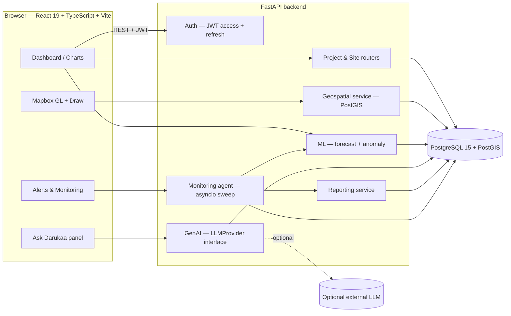
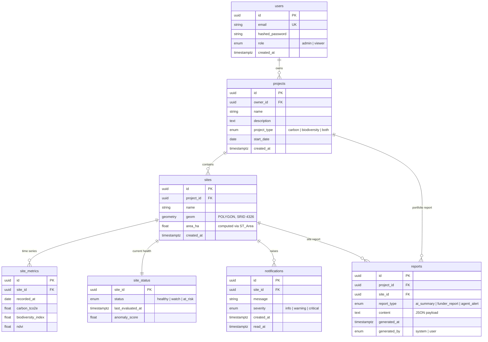

# Darukaa.Earth

**Geospatial carbon & biodiversity analytics platform.** Administrators create conservation
projects, draw monitoring sites as polygons on a map, and track each site's carbon, biodiversity
and vegetation trends over time. An ML layer forecasts those trends and scores each site for
anomalies, a GenAI assistant answers questions grounded strictly in that data, and an autonomous
agent re-evaluates every site on a schedule and files its own alerts and reports.

> **Live demo:** _<add URL after deploying — see "Deployment" below>_

---

## Table of contents

1. [What's built](#whats-built)
2. [Quick start](#quick-start)
3. [Verifying it works](#verifying-it-works)
4. [Architecture](#architecture)
5. [Database schema](#database-schema)
6. [API surface](#api-surface)
7. [The AI layers](#the-ai-layers-ml--genai--agentic)
8. [Code quality: hooks, linting, tests](#code-quality-hooks-linting-tests)
9. [Deployment](#deployment)
10. [Trade-offs](#trade-offs)
11. [Known limitations](#known-limitations)

---

## What's built

### The three core user stories

| Story | Status | Where |
|---|---|---|
| **1.** Create a project and add multiple sites by drawing polygons on a map | Done | `/app/projects/new` — Mapbox GL Draw → `POST /projects/{id}/sites` → PostGIS `ST_Area` |
| **2.** View all projects and sites on one interactive map | Done | `/app/dashboard` — polygons coloured by ML health status, clustered when zoomed out, satellite/street toggle |
| **3.** Click a site to view detailed analytics over time | Done | `/app/sites/:siteId` — Carbon / Biodiversity / NDVI charts, forecast overlay, anomaly banner |

### The differentiating layer

| Capability | Status | Where |
|---|---|---|
| Predictive forecasting with confidence intervals | Done | `GET /sites/{id}/forecast` · `services/intelligence.py` |
| Anomaly detection → site health status | Done | `GET /sites/{id}/status` · drives map polygon colour |
| "Ask Darukaa" grounded NL assistant | Done | `POST /assistant/query` · `services/genai.py` |
| Autonomous monitoring agent | Done | `POST /monitoring/run` + background sweep · `services/agent.py` |
| AI-generated site & portfolio reports | Done | `POST /reports/generate` · `services/reporting.py` |
| In-app notification feed and alerts | Done | `GET /notifications` · topbar drawer + `/app/alerts` |
| **CI/CD pipeline + public deployment** | **Remaining** | see [Deployment](#deployment) |

---

## Quick start

### Option A — Docker (recommended)

```bash
# 1. Configure
cp .env.example .env                  # root: Mapbox token + secrets for compose
cp backend/.env.example backend/.env
cp frontend/.env.example frontend/.env

# 2. Put a real Mapbox public token in the root .env
#    (free at https://account.mapbox.com/access-tokens/)
#    VITE_MAPBOX_TOKEN=pk.xxxxx

# 3. Run
docker-compose up --build
```

| Service | URL |
|---|---|
| Frontend | http://localhost:5173 |
| API docs (Swagger) | http://localhost:8000/docs |
| Health check | http://localhost:8000/health |
| Postgres + PostGIS | `localhost:5432` (`darukaa` / `darukaa` / `darukaa`) |

The backend container runs `alembic upgrade head` on startup, so the schema is created for you.

> **Without a Mapbox token** the app still runs — the map area renders a configuration notice
> instead of crashing, and every non-map feature works.

### Option B — Manual

**Backend**

```bash
cd backend
python3 -m venv .venv && source .venv/bin/activate
pip install -r requirements.txt
cp .env.example .env                   # point DATABASE_URL at your Postgres+PostGIS
alembic upgrade head
uvicorn app.main:app --reload
```

**Frontend**

```bash
cd frontend
npm install
cp .env.example .env                   # set VITE_API_URL and VITE_MAPBOX_TOKEN
npm run dev
```

> **First run: refresh the frontend lockfile.** New dev dependencies (Vitest, Testing Library,
> jsdom, `globals`) were added, so the committed `package-lock.json` is out of date. Run
> `npm install` inside `frontend/` once and commit the regenerated lockfile — otherwise
> `npm ci` (which CI will use) fails with an "out of sync" error.

**Git hooks (do this once, before your first commit)**

```bash
npm install                            # repo root — installs Husky + lint-staged
pip install pre-commit && pre-commit install --install-hooks
```

---

## Verifying it works

A step-by-step walkthrough — what to click, what should happen, and how to prove each layer
is genuinely running rather than mocked — lives in **[VERIFICATION.md](./VERIFICATION.md)**.

The short version:

```bash
# Backend unit tests (no database needed)
cd backend && pytest -m "not integration"

# Backend end-to-end tests (needs Postgres+PostGIS up and migrated)
docker-compose up -d db
cd backend && alembic upgrade head && pytest -m integration

# Frontend tests, lint and type-check
cd frontend && npm test && npm run lint && npm run build
```

---

## Architecture



**Layering.** Both sides use the same shape. On the backend, routers handle HTTP and ownership
checks, services hold the logic, models own persistence — no router contains business logic. On
the frontend, pages render, hooks manage async state, services own every `fetch` call — no
component talks to the API directly.

### Stack

| Layer | Choice | Why |
|---|---|---|
| Frontend | React 19 + TypeScript + Vite | Required; TS catches API-contract drift at build time |
| Map | Mapbox GL JS + `mapbox-gl-draw` | Required; Draw gives polygon editing for free |
| Charts | Chart.js via `react-chartjs-2` | Required option; MIT-licensed, unlike Highcharts which needs a commercial licence |
| Styling | Hand-written CSS with design tokens | ~34KB, no build step, no utility-class noise in the JSX |
| Backend | FastAPI | Required option; async-native, auto-generated OpenAPI docs, Pydantic validation, and it lives in the same language as the ML layer |
| ORM | SQLAlchemy 2.0 + Alembic + GeoAlchemy2 | Typed `Mapped[]` models; GeoAlchemy2 exposes PostGIS functions as SQL expressions |
| Database | PostgreSQL 15 + PostGIS | Required; `ST_Area`, `ST_Transform`, `ST_GeomFromGeoJSON` do the geospatial work in the database |
| Auth | JWT access + refresh, bcrypt | Refresh tokens mean short-lived access tokens without constant re-login |
| ML | scikit-learn (`IsolationForest`, `LinearRegression`) | CPU-only, trains in milliseconds per site, no GPU or model registry needed |
| GenAI | `LLMProvider` ABC + Gemini / Groq / local grounded provider | Vendor-swappable; the default needs no API key |
| Agent | in-process asyncio loop on a worker thread | No broker infrastructure for a single periodic job |

---

## Database schema



**Indexes.** GiST on `sites.geom` for spatial queries; a composite index on
`(site_id, recorded_at)` keeps the time-series reads fast as history grows.

**Design decisions.**

- Metrics are **rows, not columns**. Adding a new metric type later needs no migration and no
  wide-table rewrite.
- `site_status` is a **separate table**, not a column on `sites`. Health is a derived,
  frequently-rewritten value; keeping it out of `sites` means an agent sweep doesn't churn the
  row that holds the geometry.
- Reports store **JSON, not rendered markdown**, so the same record can be re-rendered as HTML,
  PDF or email without re-invoking the model.

---

## API surface

Everything except `/auth/register`, `/auth/login`, `/auth/refresh` and `/health` requires
`Authorization: Bearer <access_token>`. Full interactive docs at `/docs`.

```
POST   /auth/register                  create an account (admin role by default)
POST   /auth/login                     -> {access_token, refresh_token}
POST   /auth/refresh                   exchange a refresh token for a new pair
GET    /auth/me                        current user — used for session restoration

GET    /projects                       owned projects, with site counts
POST   /projects                       create a project
GET    /projects/{id}                  single project
GET    /projects/{id}/metrics          per-site summaries + aggregated portfolio series

POST   /projects/{id}/sites            create a site from a GeoJSON polygon
GET    /projects/{id}/sites            sites in a project, with health status
GET    /sites/{id}                     single site + geometry

GET    /sites/{id}/metrics?days=180    time series (30–730 days)
GET    /sites/{id}/forecast?metric=…   6-period forecast + 95% confidence band
GET    /sites/{id}/status              health band, anomaly score, human-readable reasons

POST   /assistant/query                Ask Darukaa — grounded NL answer
POST   /reports/generate               site or project report
GET    /reports                        report library
GET    /reports/{id}                   single report

GET    /notifications                  agent-raised alerts
PATCH  /notifications/{id}/read        mark one read
POST   /notifications/read-all         mark all read

POST   /monitoring/run                 trigger an agent sweep on demand
GET    /health                         liveness probe
```

**Ownership is enforced on every route.** A site is reachable only through a join back to
`projects.owner_id`; requesting another user's site returns `404`, not `403`, so the API doesn't
leak the existence of resources you can't see. There is a test for this.

---

## The AI layers (ML / GenAI / Agentic)

### 1. Forecasting — AI/ML integration

`services/intelligence.py::forecast_metric`

Fits a `LinearRegression` trend over a site's last 90 observations and projects six monthly
periods forward. The confidence band is `1.96 × σ(residuals)`, widened by `√(1 + h/H)` with the
forecast horizon, so uncertainty visibly grows the further out you look. NDVI is clamped to
`[0, 1]` and the biodiversity index to `[0, 100]` — a raw linear model will happily predict an
NDVI of 1.4, which is physically meaningless.

Results are cached in-process for an hour. Without it, every chart tab switch refits a model.

### 2. Anomaly detection — AI/ML integration + system optimization

`services/intelligence.py::score_metrics`

An `IsolationForest` over a 60-day window, blended with three explicit baseline-deviation
ratios (NDVI drop, biodiversity drop, carbon reversal) into a 0–1 score, then banded:

| Score | Status | Map colour |
|---|---|---|
| `< 0.40` | healthy | green |
| `0.40 – 0.69` | watch | amber |
| `≥ 0.70` | at risk | red |

Two decisions worth calling out:

- **The forest is fitted on first differences, not raw levels.** A healthy restoration site
  trends steadily upward, so its newest reading is always the extreme of the level distribution
  — a level-fitted forest flags every healthy site as anomalous. Period-over-period change is
  stationary, which is what we actually want to detect. There's a regression test pinning this.
- **The ratios exist so the model can explain itself.** A bare forest score is a number with no
  story. The ratios produce the human-readable reasons shown in the site banner, in agent
  alerts, and in the context handed to the GenAI layer.

Evaluations are cached for 5 minutes, so listing 50 sites doesn't fit 50 forests per page load.

### 3. Ask Darukaa — GenAI

`services/genai.py` + `POST /assistant/query`

The backend assembles a structured context — the site, its latest metrics, its health status and
reasons, and its NDVI forecast — and only then hands it to an `LLMProvider`. **The model never
queries the database itself.** That single decision is what keeps answers grounded: the assistant
cannot mention a site that isn't in the context, because it never sees one.

Three providers implement the interface:

| Provider | Needs a key? | Notes |
|---|---|---|
| `GroundedFallbackProvider` (**default**) | No | Template-based answering over the same structured context. Zero cost, zero network, fully demoable. |
| `GeminiProvider` | `GEMINI_API_KEY` | `LLM_PROVIDER=gemini` |
| `GroqProvider` | `GROQ_API_KEY` | `LLM_PROVIDER=groq` |

Any provider failure degrades to the grounded fallback rather than returning a 500. Every answer
reports which provider and model produced it, so you can always tell what you're looking at.

From a site page, "Ask Darukaa about this site" carries `siteId` and `projectId` through as
query params, so the assistant opens already scoped to what you were just looking at.

### 4. Autonomous monitoring agent — Agentic AI

`services/agent.py` + `api/routers/monitoring.py::run_for_user`

A genuine observe → decide → act → report loop:

```
every AGENT_INTERVAL_SECONDS (default 900s; 120s in the compose file so it's demoable):
  for each site the user owns:
      metrics       = fetch recent observations
      score, status = anomaly model evaluate(metrics)
      if status transitioned INTO watch or at_risk:
          report = GenAI draft_alert(site, metrics, score)   -> reports (agent_alert)
          notify(site, severity = critical | warning)        -> notifications
      persist status
```

Three things make this an agent rather than a cron job with a label:

- It **acts on a transition**, not on a state. A site that's been at risk for a week doesn't
  re-alert every sweep — you'd learn to ignore the feed within a day.
- It **writes durable artifacts** (a `Report` row and a `Notification` row), not log lines.
- The scheduled sweep and the manual `POST /monitoring/run` call **exactly the same function**.
  There is no demo-only shortcut that behaves differently from the real thing.

The sweep is synchronous SQLAlchemy and scikit-learn, so it runs via `loop.run_in_executor` on a
worker thread. Running it inline would block the event loop and stall every in-flight request for
the duration of the sweep.

---

## Code quality: hooks, linting, tests

### Pre-commit hooks

Husky owns git's `core.hooksPath` at the repo root, and `.husky/pre-commit` runs both toolchains:

```
git commit
   ├─ npx lint-staged          frontend: ESLint --fix + Prettier on staged .ts/.tsx/.css/.json/.md
   └─ pre-commit run           backend:  Black + Ruff on staged .py, plus YAML/large-file/private-key checks
```

**Why it's wired this way.** Husky sets `core.hooksPath`, which makes git ignore `.git/hooks/`
entirely — so a `pre-commit install` hook would be silently dead. Invoking `pre-commit` *from*
the Husky hook is the only arrangement where both actually run. Install once with:

```bash
npm install && pip install pre-commit && pre-commit install --install-hooks
```

### Tests

The suite targets the logic that would fail *silently* — a bad anomaly threshold mis-colours
every polygon on the map and nothing throws.

**Backend** (`pytest`)

| File | Covers |
|---|---|
| `test_intelligence.py` | Threshold boundaries, healthy-vs-degraded separation, the differencing regression guard, forecast shape, band widening, NDVI clamping, caching |
| `test_geospatial.py` | That the area SQL projects to 3857 before measuring and divides by 10,000; polygon schema validation |
| `test_security.py` | bcrypt salting, access/refresh token confusion in **both** directions, tampered-token rejection |
| `test_genai.py` | The grounded provider quotes supplied values and invents nothing on empty context |
| `test_health.py` | Every router is mounted; protected routes reject anonymous requests |
| `test_api_integration.py` | Full Story 1 path against real PostGIS, plus cross-user isolation. Auto-skips with no database. |

**Frontend** (`vitest` + React Testing Library)

| File | Covers |
|---|---|
| `pages/CreateProject.test.tsx` | Validation, the label→API type mapping, step advance, backend-failure handling, finish-button gating |
| `pages/SiteDetail.test.tsx` | Anomaly banner with score and reasons, KPI values, forecast metadata, healthy-state suppression, error state |
| `utils/geo.test.ts` | Area is hectares not m², scales quadratically, winding-order independent; centroid is `[lng, lat]` |
| `utils/formatters.test.ts` | Number and date formatting |
| `components/ui.test.tsx` | Health badge labelling and colour classes, KPI trend direction |

jsdom has no WebGL, so `src/test/setup.ts` stubs Mapbox GL. We assert on our own logic, not
Mapbox's rendering.

This is not high-coverage testing and isn't meant to be. It's targeted at the risky parts.

---

## Deployment

**This is the one remaining piece.** Everything else runs and is tested; CI/CD and the public
URL are intentionally left as the final step.

The intended shape:

- **Frontend → Vercel.** Root directory `frontend`, build `npm run build`, output `dist`.
  Set `VITE_API_URL` and `VITE_MAPBOX_TOKEN` as project environment variables.
- **Backend + database → Render.** A Python web service plus a PostGIS-enabled Postgres
  instance. Start command:
  `alembic upgrade head && uvicorn app.main:app --host 0.0.0.0 --port $PORT`.
  Set `DATABASE_URL`, `SECRET_KEY` and `CORS_ORIGINS` (must include the Vercel origin).
- **CI → GitHub Actions** at `.github/workflows/ci.yml`: a frontend job
  (`npm ci` → `lint` → `test` → `build`) and a backend job (`pip install` → `ruff check` →
  `black --check` → `pytest`), both required to pass before merge to `main`.
- **CD → push-to-deploy.** Vercel and Render both auto-deploy from `main` via their GitHub
  integrations, so there are no hand-rolled deploy scripts to maintain or break.

Before deploying, change `SECRET_KEY` from the default and restrict `CORS_ORIGINS` to the real
frontend origin.

---

## Trade-offs

**Synthetic data, honestly labelled.** Real satellite and carbon-registry ingestion is out of
reach in this timeframe, so `ensure_synthetic_metrics` generates a 180-day series per site:
an upward restoration trend, a seasonal oscillation, and an injected disturbance window so some
sites legitimately trip the detector. It's seeded from the site UUID, so the same site produces
the same history in every environment — demos and CI are reproducible. The product is built so
that swapping this one function for a real ingestion pipeline changes nothing else.

**Linear regression over Prophet/ARIMA.** A seasonal model would fit this data better. It would
also add a heavy dependency, a much slower cold start, and a forecast nobody can explain in a
two-minute demo. The linear model is honest about being simple and its confidence band widens
correctly with the horizon.

**Web Mercator for area.** `ST_Transform(geom, 3857)` distorts area at high latitudes. For
typical site sizes in tropical and temperate zones the error is acceptable; a production system
would use an equal-area projection or a geodesic calculation. This is a deliberate, documented
approximation, not an oversight.

**asyncio loop over Celery + Redis.** A broker is the right production answer — retries, multiple
workers, real observability. For a single periodic job it would mean standing up infrastructure
without adding any demonstrable capability. The trade-off is that the agent stops when the API
process stops, and it doesn't scale past one instance.

**A grounded fallback as the default LLM provider.** It means the assistant works with no API
key, no cost and no network — anyone can clone the repo and see the feature work. The cost is
that fallback answers are template-shaped rather than fluent. Setting `LLM_PROVIDER=gemini`
gives you real generation through the same interface.

**Hand-written CSS over Tailwind.** No build step, no utility-class noise, and a coherent token
system. The cost is no design-system guardrails — it relies on discipline.

**Caching rather than optimising the models.** Forecast (1h) and evaluation (5m) results are
cached in-process. This is the right call at this scale, but in-process caching doesn't survive
a restart and doesn't share across instances — Redis is the next step, not a smarter model.

---

## Known limitations

- **No CI/CD pipeline or public deployment yet** — see [Deployment](#deployment).
- **Metrics are synthetic.** Clearly labelled as such throughout; no real remote-sensing feed.
- **Single-tenant in practice.** Every user sees only their own projects, but there's no
  organisation/team model and no sharing.
- **`viewer` role is a field, not a policy.** The enum exists and the schema supports it; no
  route currently distinguishes it from `admin`.
- **The agent runs in the API process.** It stops with the process and doesn't scale
  horizontally.
- **Reports export via browser print**, not server-side PDF generation.
- **In-process caches** don't survive restarts and aren't shared across instances.
- **Notifications don't leave the app** — no email or webhook delivery.
- **Settings is read-only** — it reports real session and configuration state rather than
  offering forms that don't persist.

### What I'd do next, in order

1. Ship the CI pipeline and deploy — nothing else matters until it's live and reproducible.
2. Replace `ensure_synthetic_metrics` with a real ingestion job (Sentinel-2 NDVI is the obvious
   first source) behind the same interface.
3. Move the agent to Celery beat + Redis and move the caches to Redis with it.
4. Add an organisation model and make `viewer` an enforced policy rather than a field.
5. Server-side PDF rendering for funder reports, plus email delivery for critical alerts.
